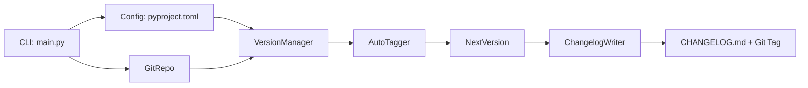

# Architecture Overview

[← Back to README](/README.md)

This document provides a high-level overview of **gitag**'s architecture, outlining modules, components, and the data flow.

## Repository Structure

```
gitag/
├── auto_tagger.py       # Commit parsing and version bump determination
├── changelog_writer.py  # Changelog generation and formatting
├── config.py            # Default settings and enums
├── config_validator.py  # Validation of user-provided config
├── git_repo.py          # Abstracts Git operations (tags, commits)
├── main.py              # CLI entry point and argument handling
├── utils/
│   ├── __init__.py
│   └── logging_setup.py # Centralized logging configuration
└── version_manager.py   # Combines config and Git data to produce versions
```

## Component Responsibilities

1. **main.py**
   - Parses CLI arguments via `argparse`.
   - Configures logging.
   - Dispatches to commands (`--dry-run`, `--changelog`, etc.).

2. **git_repo.GitRepo**
   - Interfaces with the local Git repository.
   - Retrieves latest tags and commit history.

3. **auto_tagger.AutoTagger**
   - Applies commit-message rules (Conventional Commits).
   - Determines bump level (major/minor/patch).

4. **version_manager.VersionManager**
   - Loads and validates configuration from `pyproject.toml`.
   - Uses `GitRepo` to detect tags and commits.
   - Generates the next semantic version string.

5. **changelog_writer.ChangelogWriter**
   - Formats and writes changelog entries under `Unreleased`.
   - Appends new version sections when tagging.

6. **config_validator**
   - Ensures user-provided config keys and values match expected types/patterns.

7. **utils.logging_setup**
   - Centralizes logging format, level, and handlers.

## Data Flow



## Logging & Error Handling

- All modules use the centralized logger from `utils.logging_setup`.
- Errors are caught and reported with exit codes:
  - `1`: Runtime or Git error
  - `2`: No commits since last tag

## Extensibility

- **Merge Strategies**: Swapable via config (`auto`, `always`, `merge_only`).
- **Custom Bump Keywords**: Define in `pyproject.toml` under `[tool.gitag.bump_keywords]`.
- **Plugin Hooks**: Future extension points can be added in `AutoTagger` and `ChangelogWriter`.

---

For further details, refer to each module's docstring and the [Config Reference](./CONFIG.md).
